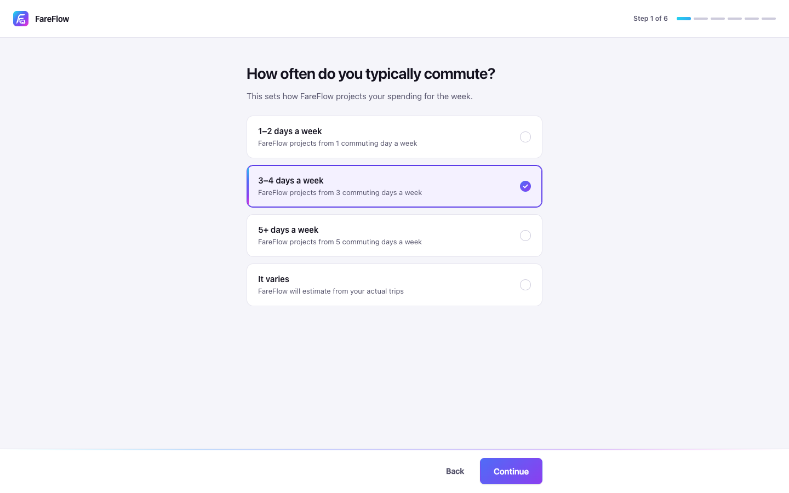
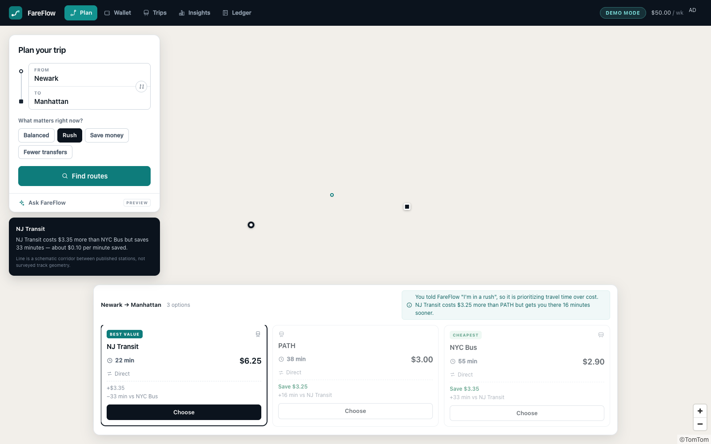

# FareFlow

FareFlow is a public-transit and fintech platform that helps riders plan, compare,
pay for, travel, and track train, subway, bus, and ferry journeys based on travel
time, fare cost, transfers, walking connections, personal budget, and current context.

Cars, taxis, rideshare, flights, and bicycle routing are deliberately outside the
product. The product loop is:

```
PLAN → COMPARE → CHOOSE → PAY → TRAVEL → TRACK → PERSONALIZE
```

The core idea: the *best* route is not always the cheapest or the fastest one.

```
Newark → Manhattan

  NJ Transit   22 min   $6.25   ← FASTEST
  PATH         38 min   $3.00   ← BEST VALUE
  NYC Bus      55 min   $2.90   ← CHEAPEST

  "PATH saves you $3.25 versus NJ Transit while adding 16 minutes
   — about $0.20 per minute of time given up."
```


FareFlow asks five short questions after signup, and then uses every answer —
a saved commute becomes a one-tap shortcut, a stated priority becomes the default
scoring stance, and a weekly budget becomes the pressure that shifts routes toward
cost as the week fills up.

```
REGISTER → ONBOARDING → TRAVEL + FINANCIAL PROFILE → PLAN → PERSONALIZED ROUTES
```



Product boundary: [docs/PRODUCT_SCOPE.md](docs/PRODUCT_SCOPE.md) · Design notes:
[docs/ONBOARDING.md](docs/ONBOARDING.md) · [docs/DESIGN.md](docs/DESIGN.md).

---

## Stack

| Layer    | Technology                                       |
| -------- | ------------------------------------------------ |
| Backend  | Java 21 (LTS), Spring Boot 3.5, Spring Security + JWT, Maven |
| Database | PostgreSQL 17, schema owned by Flyway            |
| Frontend | React 19, TypeScript, Vite, TomTom Maps SDK, Vitest + Testing Library |

No Lombok, no MapStruct, no Tailwind, and no state-management library. Ask FareFlow
uses Google's official Gen AI Java SDK with Gemini when configured; route ranking and every
financial calculation remain deterministic Java services.

---

## Prerequisites

- **Java 21** (`/usr/libexec/java_home -v 21` should resolve)
- **Maven 3.9+**
- **PostgreSQL 17** running locally
- **Node 20+**

On macOS:

```bash
brew install openjdk@21 maven postgresql@17
brew services start postgresql@17
```

Point your shell at Java 21 — Homebrew's `mvn` wrapper otherwise falls back to its
own bundled JDK:

```bash
export JAVA_HOME="$(/usr/libexec/java_home -v 21)"
export PATH="$JAVA_HOME/bin:/opt/homebrew/opt/postgresql@17/bin:$PATH"
```

Verify with `mvn -version` — it must report `Java version: 21`.

---

## Database setup

```bash
psql postgres -c "CREATE ROLE fareflow WITH LOGIN PASSWORD 'fareflow_dev_password';"
psql postgres -c "CREATE DATABASE fareflow OWNER fareflow;"
psql postgres -c "CREATE DATABASE fareflow_test OWNER fareflow;"   # for integration tests
```

Flyway creates and seeds every table on first startup. Do not create tables by hand.

---

## Running

**1. Environment file** (gitignored):

```bash
cp .env.example .env
# set DB_PASSWORD in .env
```

**2. Backend** — http://localhost:8080

FareFlow runs in one of two modes from the same build.

*Auth mode* (register/login required, `JWT_SECRET` needed):

```bash
cd backend
set -a && source ../.env && set +a
mvn spring-boot:run
```

*Demo mode* (opens straight into the app, **no secret required**):

```bash
cd backend
set -a && source ../.env && set +a
FAREFLOW_AUTH_ENABLED=false mvn spring-boot:run
```

Demo mode resolves every request to one seeded identity — **Ameer Demo**, $50/week —
chosen by the server. There is no way for a client to select a different user.
See [docs/AUTH.md](docs/AUTH.md).

`set -a` exports everything the following `source` defines, which is how `.env`
reaches Spring Boot as real environment variables. Spring Boot does not read `.env`
files natively and we deliberately avoid a library to make it.

**3. Frontend** — http://localhost:5173

```bash
cd frontend
cp .env.example .env
npm install
npm run dev            # or: VITE_AUTH_ENABLED=false npm run dev
```

`VITE_AUTH_ENABLED` should match the backend. The app also asks
`GET /api/auth/config` and trusts the server's answer, so a mismatch degrades
gracefully rather than breaking.

Open http://localhost:5173. On first run you will be asked to create a profile.

**Optional — the map basemap.** Set `VITE_TOMTOM_API_KEY` in `frontend/.env` with a
free key from <https://developer.tomtom.com/> (Maps SDK for Web). Without it, Plan
Trip renders a schematic route diagram instead of TomTom tiles; everything else —
scoring, recommendations, route selection, trip creation — works identically.
See [docs/MAP.md](docs/MAP.md).

**Optional — Ask FareFlow.** Set `GEMINI_API_KEY` in the root `.env`. Without
it the assistant panel shows a configuration notice and the planner, wallet,
history, budgets, maps, and deterministic recommendations continue to work.

**4. Verify**

```bash
curl http://localhost:8080/api/health
curl "http://localhost:8080/api/recommendations?origin=Newark&destination=Manhattan"
```

---

## Tests

```bash
cd backend  && mvn test          # 252 tests
cd frontend && npm test          # 129 tests
cd frontend && npm run typecheck
```

Integration tests use the `fareflow_test` database and rebuild it from migrations
before each test, so they never depend on leftover state.

Onboarding is covered by `OnboardingProfileIntegrationTest` (validation, ownership,
nullable budget, commute persistence, context precedence) and
`PersonalizedDemoIntegrationTest` (the seeded demo profile, and the personalized
insights arithmetic). On the frontend, `features/onboarding/__tests__` covers the
redirects and the flow, and `features/settings/__tests__` covers editing.

---

## Architecture

Modular monolith, packaged by feature rather than by layer:

```
com.fareflow
├── common/          Money, WeekWindow            (pure Java)
├── config/          bean wiring, CORS, Clock
├── exception/       one @RestControllerAdvice → RFC 9457 Problem Details
├── health/          GET /api/health
├── route/           transit catalog
├── recommendation/
│   └── optimization/    ⭐ the scoring engine — no Spring, no JPA, no HTTP
├── trip/            trip creation and cancellation
├── payment/         provider-neutral intent lifecycle + reconciliation
├── ledger/          append-only financial ledger
├── user/            users and weekly budgets
├── auth/            JWT, current-user resolution, demo-mode identity
├── wallet/          read-only projection of the ledger
├── insights/        derived spending analytics
└── budget/          derived weekly figures and the dashboard
```

Four decisions worth knowing:

**Money is integer cents end to end.** `BIGINT` in PostgreSQL, `long` in Java,
`number` of cents in TypeScript. Binary floating point cannot represent `0.1`, and
summing floats accumulates drift — the exact failure a financial system must avoid.

**The optimization package is pure Java.** It depends on no framework, so every
scoring class can be constructed with `new` in a plain JUnit test. Beans are declared
in `config/OptimizationConfig`, not by annotating the algorithm classes.

**Spending is derived, never stored.** There is no `total_spent` column anywhere.
Weekly spend is `SUM(amount_cents)` over the ledger. A mutable running total can
drift on a partial failure, cannot be audited back to its trips, cannot be corrected
retroactively, and races under concurrency.

**A payment settles, then its trip and charge commit together.** The server re-plans
and re-prices the selected journey before creating an immutable payment amount. The
payment transition, trip, and ledger charge share one transaction, while database
triggers reject updates and deletes to ledger entries and payment events.

**Unknown is never zero.** A journey without an authoritative fare can be recorded
only after explicit confirmation. It creates neither a payment intent nor a ledger
charge, so the product never represents an unavailable fare as a free trip.

### Design system

The identity comes from the app mark: a cyan → electric blue → violet → magenta
spectrum on deep navy. Two rules govern it — the gradient marks **intent, never
surface** (the mark, the primary action, thin progress and selection accents), and
anything that must be *read* uses a flat colour with a known contrast ratio.

The chart palette is deliberately **not** the brand gradient: sampled for series it
scored ΔE 1.7 between blue and violet under deuteranopia, two series most people
cannot tell apart. The palette actually shipped is validated on every axis.
[docs/DESIGN.md](docs/DESIGN.md).

### Personalization

Onboarding builds a travel profile in its own table (`user_travel_profiles`), and
the recommendation pipeline reads it as a *default* rather than as a rule:

```
current request  >  onboarding default  >  BALANCED
```

Someone whose default is `SAVE_MONEY` gets cost-leaning results all week; the
moment they pick RUSH for one trip, that wins. A stated habit never outranks a
stated situation. The weights, the scorer, and the ledger are unchanged — only the
stance *selection* moved.

The weekly budget deliberately stayed on `users`, where the ledger, wallet, and
budget-pressure weighting have always read it. It became **nullable** so "I'm not
sure" is an absence rather than a fictitious `$0.00`, and `NULL` (no budget) is
never conflated with `0` (a budget of zero). Full rationale in
[docs/ONBOARDING.md](docs/ONBOARDING.md).


### Best Value algorithm

You cannot add dollars to minutes, so each attribute is rescaled to `[0,1]` across
the candidate set (0 = best present, 1 = worst present), then weighted and summed.
**Lower score wins.**

```
normalizedFare = (fare - minFare) / (maxFare - minFare)
score = costPriority·normalizedFare + timePriority·normalizedTime
                                    + transferPriority·normalizedTransfers
```

Phase 1 weights: cost `0.45`, time `0.45`, transfers `0.10` (in `application.yml`).

When `max == min` for an attribute, its normalized value is **0 for every route**.
That attribute cannot distinguish the routes, so it contributes the same constant to
every score and cannot affect the ranking. The remaining weights are *not*
renormalized — absolute scores come out lower, relative order is unchanged.

Ties break deterministically: **score → fare → duration → transfers → route id**,
with scores compared using an epsilon of `1e-9`, never `==`.

Budget pressure is the one dynamic input: as the weekly budget fills, weight shifts
from time to cost symmetrically, so the weights still sum to 1.

```
p     = clamp(spentThisWeek / weeklyBudget, 0, 1)
shift = 0.40 · p · baseTimePriority
```

### Context profiles

The Plan trip page asks "what matters right now?" and offers four stances:

| Profile | Cost | Time | Transfers |
| --- | --- | --- | --- |
| `BALANCED` | 0.45 | 0.45 | 0.10 |
| `RUSH` | 0.15 | 0.75 | 0.10 |
| `SAVE_MONEY` | 0.75 | 0.15 | 0.10 |
| `FEWER_TRANSFERS` | 0.25 | 0.25 | 0.50 |

**The backend owns these weights.** The API accepts a profile *name*
(`?profile=RUSH`) and looks the numbers up in the `ContextProfile` enum; it never
accepts raw weights over the wire. A client cannot skew a financial trade-off.

Selecting a profile re-scores the same candidates and, when the winner changes,
the response carries a `contextNote` explaining why:

> You told FareFlow "I'm in a rush", so it is prioritizing travel time over cost.
> NJ Transit costs $3.25 more than PATH but gets you there 16 minutes sooner.

That note is produced by scoring the candidates twice — once under the profile and
once under `BALANCED` — and describing the difference. When the stance does not
change the outcome, the note is null and the UI stays quiet rather than claiming a
change that did not happen.



Worth knowing: `SAVE_MONEY` does **not** blindly pick the lowest fare. On the seeded
Newark data the cheapest route saves $0.10 and costs 17 extra minutes, so PATH still
wins even at a 0.75 cost weight. Recommending the bus there would be bad advice, and
`ContextProfileTest` pins that behaviour deliberately.

Budget pressure layers on top: your stated intent sets the baseline, and how full
your weekly budget is nudges it toward cost.

### "Saved vs. fastest route"

```
savings = baselineFareCents − fareCents
```

where the baseline is the fare of the **fastest** route for that origin/destination,
snapshotted onto the trip when it is taken.

The metric is deliberately conservative:

- If fewer than two routes existed, the user made no choice, so `baseline_fare_cents`
  is **NULL** and the trip contributes nothing. NULL means *not computable*, which is
  a different fact from a computed zero.
- When nothing in the window is computable, the API returns `null` and the UI renders
  a dash with a caption — never `$0.00`, which would read as "FareFlow saved you nothing".
- Taking the fastest route honestly yields `$0`. Taking something pricier yields a
  negative number, and it is reported rather than clamped.
- The label always names the baseline: **"Saved vs. fastest route"**, never a bare
  "You saved".

### Map architecture

Plan Trip is a full-viewport map with floating panels, deliberately different from
the sidebar shell the reporting pages use. Clicking a route card highlights its line;
clicking a line selects its card. They share one piece of state.

Geometry comes only from transit data. Curated routes use published station
coordinates; GTFS routes use imported official stops. FareFlow does not draw a
driving route and relabel it as transit. Until `shapes.txt` is ingested, lines between
stops remain explicitly schematic.

Four layers stay separate — transit/fare data, route geometry, recommendation logic,
and map rendering. The invariant that matters: **`RouteCandidate`, the type the
optimization engine consumes, has no coordinate fields**, so geometry cannot influence
a recommendation. There is a reflection test asserting it.

See [docs/MAP.md](docs/MAP.md) for what is real versus approximate.

### Route sources

Journey discovery is provider-neutral. Imported GTFS Schedule data is tried first;
the curated Philadelphia–New York graph remains an offline fallback. Both produce
the same `Journey` model, so fare calculation, recommendation scoring, payments,
personalization, AI tools, itinerary rendering, and map selection stay downstream.

GTFS identifiers are feed-scoped and normalized in Postgres. Routing is
time-dependent, honors calendars and date exceptions, can transfer across agencies,
and applies only fresh GTFS-Realtime facts. `GET /api/transit/coverage` reports what
has actually imported—not merely what is configured.

See [docs/TRANSIT_DATA.md](docs/TRANSIT_DATA.md) for exactly what is needed to
replace mock routes with real data, and which options require credentials.

### The AI boundary

Ask FareFlow is implemented as a stateless, tool-using assistant. The model receives
no private rider data or financial figures in its prompt. It can only retrieve them
through server-side tools that call the same budget, insights, history, profile,
pass, trip, and journey-planning services used by the rest of the application.
Identity always comes from the authenticated request; no tool accepts a user id.

When the assistant plans a journey, the server returns the exact priced
`JourneySearchResponse` to both the model and the client. The map and comparison
drawer therefore update from deterministic planner output, not model-authored route
data. Null and unavailable values stay null; the system prompt expressly prohibits
inventing schedules, reliability, platforms, fares, or durations.

Every response returns `weightsUsed` and a per-route `breakdown`, so any
recommendation can be replayed and verified.

---

## API

| Method | Path | Purpose |
| ------ | ---- | ------- |
| `GET`  | `/api/health` | liveness |
| `GET`  | `/api/recommendations?origin=&destination=&profile=&userId=` | scored routes + explanations |
| `GET`  | `/api/recommendations/profiles` | the selectable context profiles |
| `GET`  | `/api/profile/options` | the vocabularies onboarding may offer |
| `GET`  | `/api/profile` | the caller's travel profile |
| `PUT`  | `/api/profile` | edit the profile (never re-opens onboarding) |
| `PUT`  | `/api/onboarding` | submit onboarding and mark it complete |
| `GET`  | `/api/insights/history?range=7d|30d|3m|1y` | real trip-history chart series |
| `GET`  | `/api/assistant/config` | assistant availability and personalized starters |
| `POST` | `/api/assistant/ask` | one question plus browser-held conversation history |
| `GET`  | `/api/journeys?from=&to=&profile=` | sourced, priced public-transit alternatives |
| `GET`  | `/api/transit/coverage` | imported regions, agencies, service window, and live-data status |
| `POST` | `/api/journeys/take` | compatibility purchase; records explicitly confirmed unpriced trips without charging |
| `POST` | `/api/payments/intents` | create an idempotent, server-priced payment intent |
| `POST` | `/api/payments/intents/{id}/confirm` | authorize, settle, create trip, and append charge |
| `POST` | `/api/payments/intents/{id}/retry` | safely retry a failed authorization |
| `POST` | `/api/payments/intents/{id}/refund` | append a refund and cancel the trip |
| `GET`  | `/api/payments/intents` | paginated payment history |
| `GET`  | `/api/payments/reconciliation` | verify payment, trip, and ledger agreement |
| `GET`  | `/api/wallet` | weekly budget, payment methods, activity, and payments |
| `GET`  | `/api/transit-routes?origin=&destination=` | raw catalog |
| `GET`  | `/api/transit-routes/locations` | known origins/destinations |
| `POST` | `/api/users` | create a user |
| `GET`  | `/api/users/{id}` | fetch a user |
| `PATCH`| `/api/users/{id}/budget` | update the weekly budget |
| `POST` | `/api/trips` | take a route → trip + `TRIP_CHARGE` |
| `POST` | `/api/trips/{id}/cancel` | cancel → appends `REFUND` |
| `GET`  | `/api/users/{id}/trips` | paginated trip history |
| `GET`  | `/api/users/{id}/ledger` | paginated ledger |
| `GET`  | `/api/users/{id}/dashboard` | weekly figures + recent trips |

A search with no matches returns **200 with an empty `options` array**, not 404 — a
search that finds nothing is still a successful search.

Errors are RFC 9457 Problem Details, produced by a single `@RestControllerAdvice`.

---

## Configuration

All database configuration comes from environment variables. `application.yml` supplies
defaults for non-secret values only; `DB_PASSWORD` has no default, so the application
fails fast rather than silently connecting with an empty password.

Flyway owns the schema. Hibernate runs `ddl-auto: validate` and is never permitted to
create or alter tables.

---

## Known limitations

Deliberate Phase 1 scope, not oversights:

- **Tokens live in `localStorage`**, which is XSS-readable. Accepted trade-off for a
  stateless API with no cookie/CSRF machinery; an httpOnly refresh cookie is the next step.
- **Logout is client-side.** The JWT is stateless, so signing out discards it. Server-side
  revocation needs a shared store (Redis), which is a later phase.
- **No rate limiting** on `/api/auth/login` or `/api/auth/register`. Registration also
  reveals whether an email is already taken, which is unavoidable for a usable signup flow;
  rate limiting is the real mitigation.
- **GTFS coverage is opt-in and publisher-dependent.** Boston MBTA, Chicago CTA, and
  Bay Area BART feeds are registered, but a region is only marked supported after a
  successful import whose service window is current. The curated Philadelphia–New
  York network remains the offline fallback. See `docs/TRANSIT_DATA.md`.
- **AI is optional and not a source of truth.** Without a Gemini key the assistant
  is unavailable; with one it can orchestrate FareFlow services, but route selection,
  fares, budgets, projections, and history aggregation remain deterministic.
- **Payments are simulated.** FareFlow Wallet and the simulated card rail exercise the
  complete provider-neutral lifecycle, but no real money or card data moves yet. A
  sandbox provider can implement the same boundary without changing trips, ledger,
  budgets, or checkout.
- **Insights projections are naive.** The monthly figure extrapolates from a single week and
  says so on the page. It becomes meaningful with several weeks of history.
- **Single-entry ledger.** Signed amounts against one user, not double-entry accounting.
  The append-only design, signed amounts, and typed entries make that migration a schema
  change rather than a rewrite — but there is no counterparty to reconcile against yet.
- **The test database password has a local default** in `src/test/resources/application-test.yml`
  for a disposable database. Override with `DB_PASSWORD` anywhere else.
- **No end-to-end browser tests.** Component tests cover the pages; there is no Playwright suite.
- **Onboarding is all-or-nothing.** Answers are held in the client and submitted once at the
  summary, so closing the tab on step three writes nothing. Honest (they did not finish),
  but a rider who gets interrupted starts over.
- **The weekly projection assumes two trips per commuting day** and that the pattern holds.
  Both assumptions are stated on the page rather than buried, and the day count is the low
  end of each band so the figure understates rather than overstates.
- **Preferred travel modes are collected but not yet scored.** They shape nothing in the
  ranking today; the ranking has no mode-affinity term to feed. Stored for when it does.
- **The selected-route note can overlap the results drawer** on short viewports when many
  options are returned. Pre-existing Plan-overlay behaviour, not introduced by onboarding.
- **Map geometry is schematic.** Curated station or official GTFS stop coordinates are
  connected by straight lines. Track-accurate geometry requires GTFS `shapes.txt`.
- **Geocoding degrades to a finite gazetteer.** TomTom Search handles broad free-text
  coverage when configured; the keyless fallback includes major supported-region places.
- **No Docker, CI, metrics, or tracing.**

---

## Phase 2 candidates

1. Rate limiting and an httpOnly refresh-token flow to harden the auth already in place.
2. Natural-language context → sanitized `OptimizationWeights` via `AiPreferenceResolver`,
   reusing the profile interaction model already in place.
3. A live `TransitRouteProvider` (see `docs/TRANSIT_DATA.md` for the credential requirements).
4. Fare caps, peak/off-peak pricing, and pay-per-ride vs. weekly-pass optimization.
5. Spending analytics and forecasting across multiple weeks.
6. Docker Compose, GitHub Actions CI, and structured metrics.
