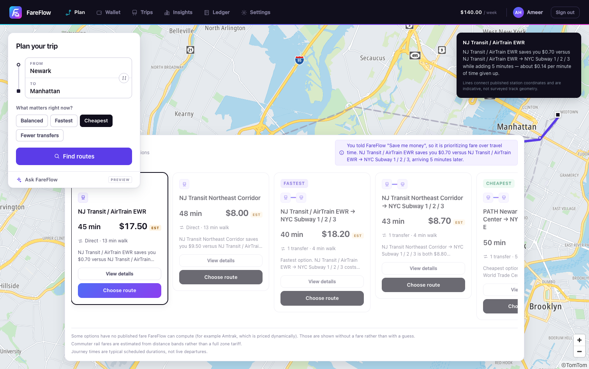
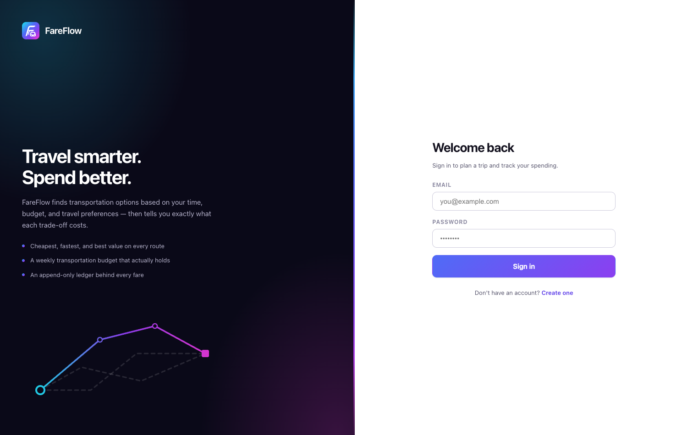
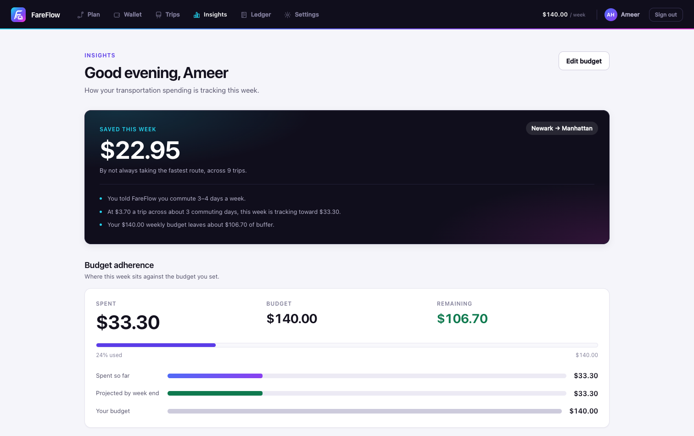

# FareFlow

FareFlow is a full-stack transit and financial planning platform that helps riders
find public-transit routes, compare time and cost trade-offs, track a trip stop by
stop, and understand their transportation spending.

Unlike ticket-based systems, FareFlow uses a configurable **stop-based fare
engine**. Charges are calculated from confirmed travel progress, service type,
transfers, rider eligibility, and fare caps. Waiting time and delays never increase
the fare.

> FareFlow pricing and payments are product simulations, not official agency fares
> or claims of agency acceptance.



## Features

- Address-to-address transit planning through Google Routes, imported GTFS data,
  and a curated offline network with 22 stops across 9 lines.
- Context-aware route ranking for balanced, fastest, cheapest, and fewer-transfer
  preferences.
- Interactive maps with route lines, stop markers, current-stop progress, and
  provider-backed stop names.
- Stop-based pricing for buses, provider-labeled express buses, rail, subway,
  light rail, and ferries.
- Boarding charges, per-stop charges, operator transfer credits, student/senior/
  reduced fares, and daily or weekly caps.
- Skipped-stop, route-diversion, transfer, and early-trip-ending support.
- Secure multi-user registration and JWT authentication with isolated profiles,
  trips, budgets, wallets, and payment histories.
- Append-only fare events and ledger entries for auditable trip charges.
- Personalized spending insights and an optional Gemini-powered assistant.

## Screenshots

<table>
  <tr>
    <td></td>
    <td></td>
  </tr>
  <tr>
    <td align="center"><strong>Multi-user authentication</strong></td>
    <td align="center"><strong>Personalized spending insights</strong></td>
  </tr>
</table>

## Technology

| Layer | Technology |
| --- | --- |
| Frontend | React 19, TypeScript, Vite, ECharts, TomTom Maps SDK |
| Backend | Java 21, Spring Boot 3.5, Spring Security, JWT, Maven |
| Data | PostgreSQL 17, Spring Data JPA, Flyway |
| Routing | Google Routes API, GTFS Schedule/Realtime, curated fallback graph |
| Testing | JUnit, Spring Boot Test, Vitest, Testing Library |

## Architecture

```text
React client
    |
    v
Spring Boot REST API
    |-- authentication and user profiles
    |-- route discovery and recommendation scoring
    |-- stop-based fare and transit-session lifecycle
    |-- payments, append-only ledger, wallet, and insights
    v
PostgreSQL + Flyway migrations
```

Financial values use integer cents end to end. Route providers supply transit
facts, while FareFlow owns recommendation scoring, stop-based pricing, payments,
history, and personalization.

## Prerequisites

- Java 21
- Maven 3.9+
- Node.js 20+
- PostgreSQL 17

On macOS:

```bash
brew install openjdk@21 maven postgresql@17
brew services start postgresql@17
```

## Local setup

### 1. Create the databases

```bash
psql postgres -c "CREATE ROLE fareflow WITH LOGIN PASSWORD 'fareflow_dev_password';"
psql postgres -c "CREATE DATABASE fareflow OWNER fareflow;"
psql postgres -c "CREATE DATABASE fareflow_test OWNER fareflow;"
```

Flyway creates and validates the schema when the backend starts.

### 2. Configure the backend

Create a gitignored `.env` in the repository root:

```dotenv
DB_URL=jdbc:postgresql://localhost:5432/fareflow
DB_USERNAME=fareflow
DB_PASSWORD=fareflow_dev_password
SERVER_PORT=8080

FAREFLOW_AUTH_ENABLED=true
JWT_SECRET=paste-a-random-secret-with-at-least-32-bytes-here
JWT_EXPIRATION=86400

# Optional integrations
GOOGLE_MAPS_ROUTES_API_KEY=
TOMTOM_API_KEY=
GEMINI_API_KEY=
```

Generate a local JWT secret with `openssl rand -base64 48`. Authentication mode
supports separate user accounts; do not set `FAREFLOW_AUTH_ENABLED=false` when
testing multi-user behavior.

### 3. Configure the frontend

```bash
cd frontend
cp .env.example .env
```

Add `VITE_TOMTOM_API_KEY` to `frontend/.env` for TomTom map tiles. Without a key,
FareFlow uses a schematic route map.

### 4. Run FareFlow

Backend — <http://localhost:8080>:

```bash
cd backend
set -a
source ../.env
set +a
mvn spring-boot:run
```

Frontend — <http://localhost:5173>:

```bash
cd frontend
npm install
npm run dev
```

Verify the backend:

```bash
curl http://localhost:8080/api/health
curl http://localhost:8080/api/auth/config
```

## Main API endpoints

Protected endpoints require `Authorization: Bearer <token>`.

| Method | Endpoint | Purpose |
| --- | --- | --- |
| `GET` | `/api/health` | Application health |
| `GET` | `/api/auth/config` | Authentication mode |
| `POST` | `/api/auth/register` | Create an account |
| `POST` | `/api/auth/login` | Sign in and receive a JWT |
| `GET` | `/api/auth/me` | Current authenticated user |
| `GET` | `/api/locations?q=` | Address and place autocomplete |
| `GET` | `/api/journeys?from=&to=&profile=` | Find and rank transit journeys |
| `POST` | `/api/transit-sessions` | Start a stop-based trip session |
| `POST` | `/api/transit-sessions/{id}/advance` | Record a reached, skipped, or diverted stop |
| `POST` | `/api/transit-sessions/{id}/end` | End the trip at its actual stop |
| `POST` | `/api/transit-sessions/{id}/pay` | Pay the final simulated fare |
| `GET/PUT` | `/api/profile` | Read or update travel preferences |
| `GET` | `/api/trips` | Paginated trip history |
| `GET` | `/api/wallet` | Budget, balance, and recent activity |
| `GET` | `/api/ledger` | Append-only charge and refund history |
| `GET` | `/api/insights` | Personalized spending analytics |
| `POST` | `/api/assistant/ask` | Ask the optional FareFlow assistant |

API errors use RFC 9457 Problem Details. Financial commands use server-owned
pricing and idempotency keys where duplicate submission could move money.

## Tests

```bash
cd backend && mvn test
cd frontend && npm test
cd frontend && npm run typecheck
cd frontend && npm run build
```

Integration tests use `fareflow_test`; they do not depend on production or local
application data.

## Additional documentation

- [Authentication](docs/AUTH.md)
- [Map and route geometry](docs/MAP.md)
- [Transit data and GTFS](docs/TRANSIT_DATA.md)
- [Product scope](docs/PRODUCT_SCOPE.md)
